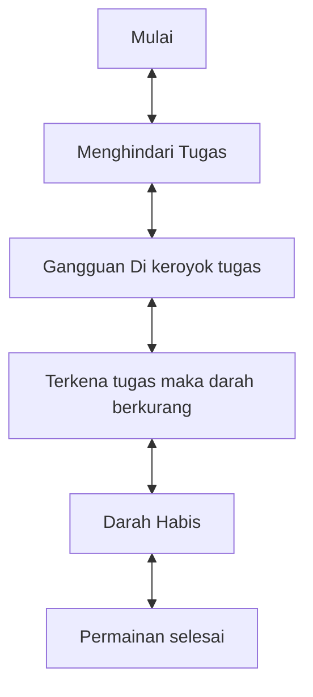

# GAME "Menghindari Tugas"
## 1. Latar Belakang 

    Game merupakan media hiburan yang dapat digunakan untuk setiap orang dan dapat digunakan untuk menghilangkan rasa jenuh. Dalam projek ini saya membuat game yang bernama Menghindari Tugas. Jadi game ini adalah seseorang 
  yang mencoba untuk menghindari tugas yang berdatangan secara terus memnerus

## 2. Deskripsi 

    Game "Menghindari Tugas" ini merupakan game sederhana yang sangat seru dan menyenangkan. game ini bercerita tentang seseorang yang berusaha menghindar dari tugas. ia bisa berjalan untuk menghindari tugas yang bisa 
  saja muncul setiap saat, tugas akan terus muncul seperti masalah dengan tingkatannya masing masing. pada akhirnya kelihaian seorang seperti apapun dalam menghindari masalah masalah akan terus datang dan dihadapi. 

## 3. Branding
### A. Nama/Merk Game :
Menghindari Tugas
### B. Deskripsi Target User :
- Usia 10 tahun ke atas
- Seorang yang mencari hiburan saat bermain game
### C. Genre :
- Simulation

## 4. User Story
 pemain mencoba menghindari tugas yang berdatangan dengan tingkat kesulitan sendiri, jika pemain terkena oleh tugas maka darah berkurang. layaknya masalah yang ada dihidup ini pada akhirnya sang pemain
 tidak bisa menghindari tugas dan harus menghadapinya.
Sebagai | Saya Ingin Bisa | Sehingga | Prioritas
---|---|---|---
Player | Berjalan menghindari tugas | kita tak benar benar bisa menghindarinya | ⭐⭐⭐⭐⭐

## 5. Desain User Interface

## 6. Flowchart dari Algoritma

## 7. Link demo game di youtube

[In Progress]

## 8. Link folder kode pemrograman dari game

[In Progress]

## 9. Game menerapkan prinsip-prinsip dasar pemrograman seperti

   - Variable
   - Data Type
   - Operator
   - Boolean
   - Conditions: if / else / switch
   - Looping: while / for
   - Array
   - Method
   - Class
