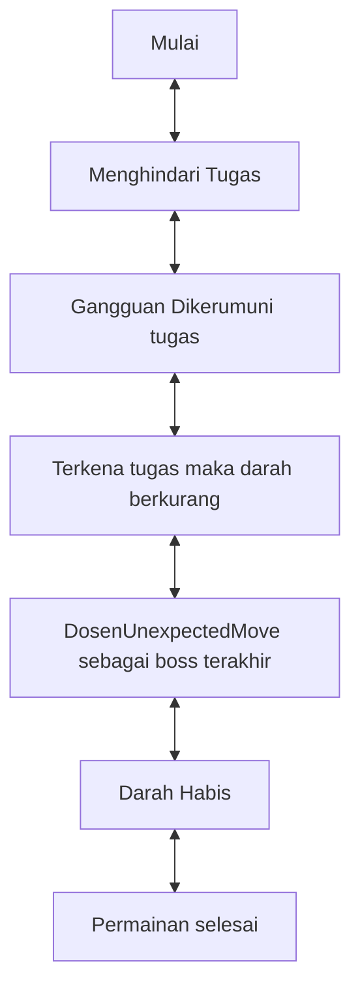

# GAME "Menghindari Tugas"
## 1. Latar Belakang 

    Game merupakan media hiburan yang dapat digunakan untuk setiap orang dan dapat digunakan untuk menghilangkan rasa jenuh. Dalam projek ini saya membuat game yang bernama Menghindari Tugas. Jadi game ini adalah seseorang yang mencoba untuk menghindari tugas yang berdatangan secara terus memnerus

    Game ini saya buat atas keresahan saya sendiri dengan kondisi dimana kebanyakan orang memilih untuk menghindari masalah dari pada menghadapinya. padahal jika kita sadar, sejak kita lahir, kita memang dibentuk untuk selalu menjadi seorang pembelajar, dari saat dilahirkan hingga akhir hayat. jadi game ini memiliki makna tersembunyi yaitu untuk menyadarkan setiap player yang memainkannya bahwa masalah akan terus mendatangi kita dan hal yang bijak bagi kita sendiri ialah menghadapinya. jika bisa mengutip perkataan seseorang, maka kata kata tan malaka ini adalah kata yang paling tepat " terbentur, terbentur, terbentuk."  

## 2. Deskripsi 

    Game "Menghindari Tugas" ini merupakan game sederhana yang sangat seru dan menyenangkan. game ini bercerita tentang seseorang yang berusaha menghindar dari tugas. ia bisa berjalan untuk menghindari tugas yang bisa 
  saja muncul setiap saat, tugas akan terus muncul seperti masalah dengan tingkatannya masing masing. pada akhirnya kelihaian seorang seperti apapun dalam menghindari masalah masalah akan terus datang dan dihadapi. 

## 3. Branding
### A. Nama/Merk Game :
Menghindari Tugas
### B. Deskripsi Target User :
- Usia 10 tahun ke atas
- Seorang yang mencari hiburan saat bermain game
### C. Genre :
- Simulation

## 4. User Story
 pemain mencoba menghindari tugas yang berdatangan dengan tingkat kesulitan sendiri, jika pemain terkena oleh tugas maka darah berkurang. layaknya masalah yang ada dihidup ini pada akhirnya sang pemain
 tidak bisa menghindari tugas dan harus menghadapinya.
Sebagai | Saya Ingin Bisa | Sehingga | Prioritas
---|---|---|---
Player | Berjalan menghindari tugas | kita tak benar benar bisa menghindarinya | ⭐⭐⭐⭐⭐
TugasFisdas| muncul dengan random bergerak cara memantul didalam jendela permainan| bisa mengurangi darah player| ⭐⭐⭐⭐⭐
TugasKalkulus| muncul dengan random lalu bergerak lebih cepat dengan cara memantul didalam jendela permainnan | bisa mengurangi darah player | ⭐⭐⭐⭐⭐
Laprak | muncul dengan cara random lalu bergerak mengejar playedr saat player memasuki jarak tertentu | bisa mengejar dan mengurangi darah player | ⭐⭐⭐⭐⭐
TugasDaspro | muncul dengan cara random lalu bergerak menyerupai gelombang dimana saat memantul ke bawah ia akan meningkatkan kecepatan, namun saat sudah mencapai ketinggian tertentu dia akan mengurangi kesepatan | bisa mengurangi darah player | ⭐⭐⭐⭐⭐
DosenUnexpectedMove | muncul dari ajas jendela degan ukuran yg lebih besar, kemudian bergerak kekanan ataupun kekiri lalu bisa menembakkan peluru(tugas) dan sebagai musuh terakhir | bisa membuat player kewalahan | ⭐⭐⭐⭐⭐
Tugas daspro | menjadi peluru dari DosenUnexpectedMove | bisa mengurangi darah player | ⭐⭐⭐⭐⭐
## 5. Desain User Interface

## 6. Flowchart dari Algoritma

## 7. Link demo game di youtube

[In Progress]

## 8. Link folder kode pemrograman dari game

[https://github.com/RioSudrajat/ProjectGame1/tree/main/Project%20Game-Menghindari%20tugas]

## 9. Game menerapkan prinsip-prinsip dasar pemrograman seperti

   - Variable
   - Data Type
   - Operator
   - Boolean
   - Conditions: if / else / switch
   - Looping: while / for
   - Array
   - Method
   - Class
